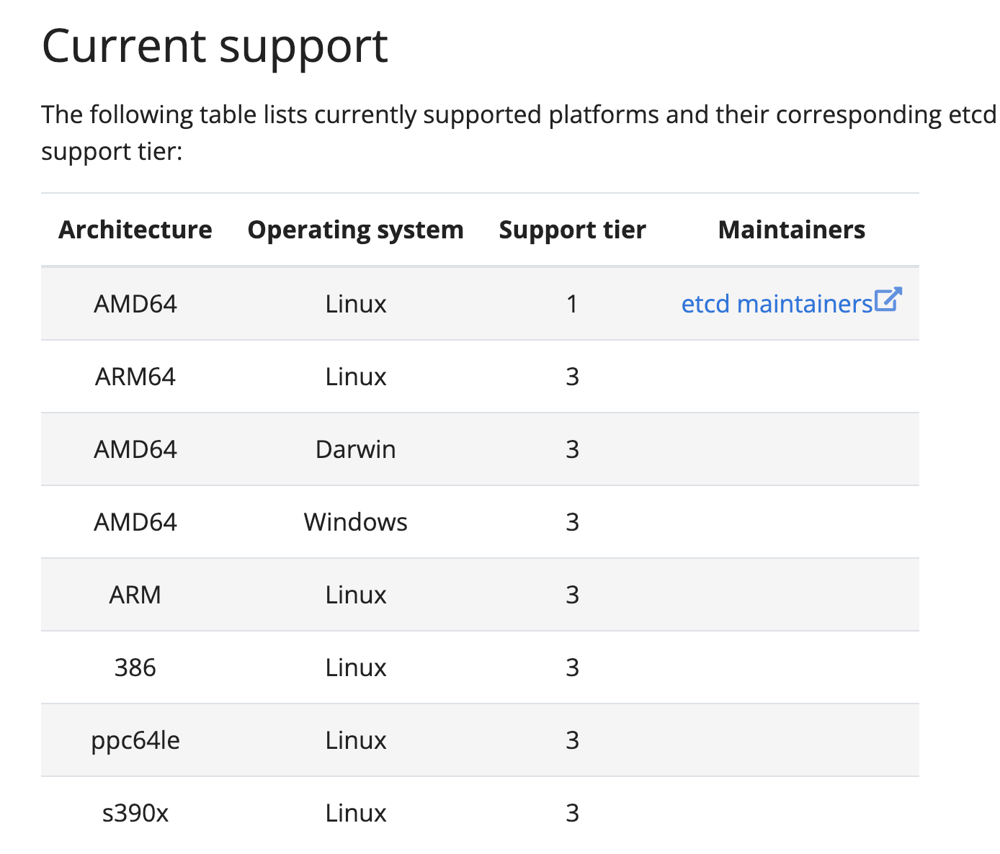

# LearnETCD

## ETCD是什么、名字怎么来的？
ETCD的名字是怎么来的？其实源于两个想法，即unix/etc文件夹和分布式系统"d"istibuted。"/etc"文件夹是单个系统存储配置数据的地方，而ETCD存储大规模分布式系统的配置信息，因此"d"istibuted的"/etc"，为"etcd"。ETCD以一致性和容错的方式存储元数据。分布式系统使用ETCD作为一致性键值存储，用于配置管理，服务发现和协调分布工作。使用ETCD的通用分布式模型包括领导选举，分布式锁和监控机器活动。
[//]: # (ETCD是分布式键值对存储，设计用来可靠而快速的保存关键数据并提供访问。通过分布式锁，leader选举和写屏障&#40;write barrieers&#41;来实现可靠的分布式写作。ETCD集群是为高可用，持久性数据存储和检索而准备。)


## ETCD支持的平台


### Support tier
- 第 1 层：由etcd 维护者全力支持；etcd 保证通过所有测试，包括功能和压力测试。
- 第 2 层：etcd 保证通过集成和端到端测试，但不一定通过功能或压力测试。
- 第 3 层：保证 etcd 可以构建，可能会被轻微测试（或不被测试），因此它应该被认为是不稳定的。

## ETCD的使用场景及特点
### 使用场景
1. etcd 在稳定性、可靠性和可伸缩性上表现极佳，同时也为云原生应用系统提供了协调机制。
2. etcd 经常用于服务注册与发现的场景，此外还有键值对存储、消息发布与订阅、分布式锁等场景。
### 特点
1. 简单；安装配置简单，而且提供了 HTTP API 进行交互，使用简单。
2. 键值对存储；数据存储在分层组织的目录中，类似于我们日常使用的文件系统。
3. 监测变更；监测特定的键或目录，并对更改进行通知。
4. 安全；支持 SSL 证书验证。
5. 快速；根据官方提供的 benchmark 数据，单实例支持每秒 2k+ 读操作
6. 可靠；基于 Raft 共识算法，实现分布式系统内部数据存储、服务调用的一致性和高可用性。

## ETCD的键值对存储
- 采用kv型数据存储，比关系型数据库快
- 支持内存动态存储和磁盘静态存储
- 分布式存储，可部署多个节点集群
- 存储方式类似目录结构；只有叶子节点才能真正存储数据，相当于文件。叶子节点的父节点一定是目录，目录不能存储数据

## ETCD安装

### 下载安装包

- 下载地址：https://github.com/etcd-io/etcd/releases/

1. 解压  `tar zxvf etcd-v3.5.0-linux-amd64.tar.gz ` 并进入文件夹

   ```shell
   $ ls
   Documentation  etcdctl  README-etcdctl.md  README.md
   etcd           etcdutl  README-etcdutl.md  READMEv2-etcdctl.md
   ```

2. 将 `etcd` 、`etcdctl`复制到 `/usr/local/bin`目录下 ` sudo cp etcd etcdctl /usr/local/bin`

   ```shell
   $ ls /usr/local/bin
   docker-compose  etcd     jsonschema  normalizer  npx  pip3     __pycache__
   dotenv          etcdctl  node        npm         pip  pip3.10  wsdump.py
   ```

3. 创建文件夹并将etcd解压后的文件夹复制进去

   ```shell
   sudo mkdir /usr/local/etcd
   sudo cp -r etcd-v3.5.0-linux-amd64 /usr/local/etcd
   ```

4. 验证

   ```shell
   $ etcd --version
   etcd Version: 3.5.0
   Git SHA: 946a5a6f2
   Go Version: go1.16.3
   Go OS/Arch: linux/amd64
   ```


## API


### 查看API版本

```shell
$ etcdctl version
etcdctl version: 3.5.0
API version: 3.5
```

### 写入、读取、删除key值＆监控值变化

```shell
$ etcdctl put hello "hello,etcd"
OK
$ etcdctl get hello
hello
hello,etcd


$ etcdctl put h1 1
$ etcdctl put h2 2
$ etcdctl put h3 3

// 获取从h1-h4的值
$ etcdctl get h1 h4 --print-value-only
1
2
3
// 获取前缀为h的值
$ etcdctl get --prefix h --print-value-only
1
2
3

// 监控单个值 key的值改变或是key被删除都会被监听到，不存在的key也能监听
$ etcdctl watch xxx

// 监控多个值
$ etcdctl watch -i
watch h1
watch h2

// 监控xx前缀的key
etcdctl watch --prefix xx
```

### 设置、撤销、续租约＆获取租约信息

```shell
//设置租约: 一个key被绑定到一个租约上时，它的生命周期与租约的生命周期绑定
// 一个租约可以绑定多个key
$ etcdctl lease grant 120
lease 694d867d086ac245 granted with TTL(120s)

$ etcdctl put --lease=694d867d086ac245 hello "world"
OK

$ etcdctl get hello --print-value-only
world

// 过了120s 就获取不到hello了

// 主动撤销租约 撤销租约将删除其所有绑定的key
$ etcdctl put hello hi --lease=694d867d086ac24d
OK
$ etcdctl get hello
hello
hi
$ etcdctl lease revoke 694d867d086ac24d
lease 694d867d086ac24d revoked
$ etcdctl get hello
// 无返回
$ 


// 续租约 通过刷新其TTL来保持租约有效性，使其不会过期
$ etcdctl put hello hi --lease=694d867d086ac256
OK
// 自动定时执行续租约，续约成功后每次租约为60秒
$ etcdctl lease keep-alive 694d867d086ac256
lease 694d867d086ac256 keepalived with TTL(60)
lease 694d867d086ac256 keepalived with TTL(60)

// 获取租约信息
$ etcdctl lease grant 999
lease 694d867d086ac259 granted with TTL(999s)
$ etcdctl put hello hi 694d867d086ac259
OK
$ etcdctl lease timetolive --keys 694d867d086ac259
lease 694d867d086ac259 granted with TTL(999s), remaining(972s), attached keys([])

```


